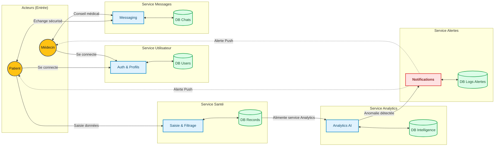

# 🩺 CareConnect : L'IA au service du suivi médical

> **CareConnect** est une plateforme de santé connectée de nouvelle génération conçue pour rapprocher médecins et patients. Grâce à un suivi des données en temps réel, une messagerie sécurisée et une analyse prédictive propulsée par l'IA, anticipez les anomalies et optimisez la prise en charge médicale.

---

## Fonctionnalités clés

Notre application simplifie le suivi médical grâce aux outils suivants :

* **Gestion des comptes** : Création et modification facile des profils.
* **Connexion sécurisée** : Accès séparés et sécurisés pour les médecins et les patients.
* **Suivi de santé** : Renseignement manuel et régulier des constantes médicales par le patient.
* **Filtrage intelligent** : Tri rapide des dossiers et des données selon les maladies.
* **Données protégées** : Stockage privé et hautement sécurisé de toutes les informations médicales.
* **Analyse par IA** : Le système étudie l'historique pour repérer et prévoir les problèmes de santé.
* **Alertes en temps réel** : Notifications directes (Push) dès qu'une donnée médicale est anormale.
* **Espace Médecin** : Un écran dédié pour surveiller facilement tous ses patients.
* **Espace Patient** : Un écran personnel pour suivre sa propre santé au quotidien.
* **Messagerie privée** : Discussion directe et confidentielle entre le patient et son médecin.
* **Rapports PDF** : Exportation et impression des historiques médicaux en un clic.

---

## Architecture des modules

L'application est découpée en domaine métier pour assurer sa scalabilité et sa maintenabilité. 

Les fonctionnalités sont ensuite regroupées par domaine : 

| Module | Fonctionnalités incluses |
|---|---|
| User | Création / modification de comptes, authentification admin/user |
| Record | Saisie manuelle de données de santé, stockage sécurisé des données patient, filtrage par maladie |
| Analytics | Analyse prédictive des historiques |
| Messaging | Messagerie sécurisée |
| Notification | Alertes push en cas d'anomalie |

---

## Diagramme de classe 

## Architecture des modules

### Architecture n-tiers

#### Architecture Decision Records

#### ADR-001 - Choix de PostgreSQL
**Statut :** Accepté

#### Contexte
 
Les données sont structurées et doivent rester cohérentes entre elles. Pour les messages on a le JSONB pour les stocker en document.

#### Décision
On utilise PostgreSQL.

#### Conséquences
Ce choix permet de gérer facilement les relations entre données et faire des requetes simples/complexes.

### Architecture microservices

en rouge : asynchrone
en bleu : synchrone

#### Architecture Decision Records

#### ADR-001 - Base de données du service utilisateur
**Statut :** Accepté

#### Contexte
Le service utilisateur gère des données structurées comme les noms, les mails qui doivent avoir une structure précise

#### Décision
On utilise PostgreSQL.

#### Conséquences
Les données sont bien organisées et toujours sous le bon format

---

#### ADR-002 - Base de données du service record
**Statut :** Accepté

#### Contexte
Le service record gère des données structurées qui doivent rester fiables et simples à consulter. Surtout au niveau des entrees du patient, on doit pouvoir facilement faire des filtrages 

#### Décision
On utilise PostgreSQL.

---

#### ADR-003 - Base de données du service messagerie
**Statut :** Accepté

#### Contexte
Le service messagerie traite des messages qui peuvent avoir des formats différents et des longueurs differentes et meme des pieces jointes

#### Décision
On utilise MongoDB.

#### Conséquences
Le schéma est plus souple et plus simple à faire évoluer.

---

#### ADR-004 - Base de données du service analytics
**Statut :** Accepté

#### Contexte
Le service analytics manipule des données d’analyse avec des donnees de predictions bien precises

#### Décision
On utilise PostGre.

#### Conséquences
On peut stocker facilement des données et faire des requetes simples ou complexes

---
#### ADR-005 - Base de données du service alerte
**Statut :** Accepté

#### Contexte
Le service alerte gère des notifications, des messages differents et des paramètres qui peuvent évoluer.

#### Décision
On utilise MongoDB.

#### Conséquences
Le modèle reste flexible et adapté aux changements.

---
#### ADR-006 - Choix du bus d’événements
**Statut :** Accepté

#### Contexte
L'analyse peut prendre 2 secondes. On ne veut pas que l'application du patient "freeze" pendant ce temps. On envoie la donnée dans Kafka, et le service Analytics la traitera dès qu'il est disponible.

#### Décision
On utilise Kafka.

#### Conséquences
Les services communiquent de façon asynchrone.  

### Communication Event-Driven (Kafka)

La communication entre les services est principalement asynchrone via Apache Kafka. Ce choix permet de découpler les services et de garantir que le système reste réactif même sous forte charge.
* Le Service Record produit un événement sur le topic health-records.
* Le Service IA consomme ce topic, charge un modèle IA et produit une prediction.
* Le Service Alerte consomme la prédiction et, si nécessaire, produit un événement alerts.
* Le Service Messagerie consomme l'alerte et déclenche l'envoi vers l'utilisateur final.
  
